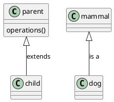
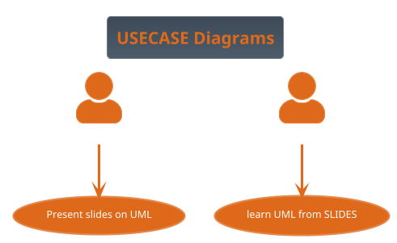
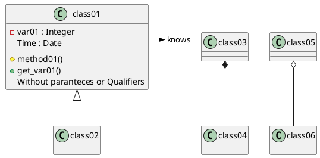
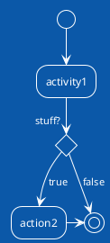
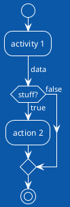

# Software development processes

## SDLC
*SDLC* ,or the Software Development Life Cycle, is a model describing the process of bringing a peice of software to market and maintaining it. The basic steps or as they are know phases each encompass different tasks needed to be completed as the software goes from idea to frution.
<image src="./img/SDLC.png">
 Generalized SDLC phases as a cycle of steps where the cicle is traversed multiple times, there is a week correlation between cycles and versions
You will if you google around many varitations of this and the phases can change some what but the genreal idea stays constant. The following illustations show both a variation of the common lifecycel model and  the ISO/IEC 12207 model described in ISO/IEC TR 24748-1:2010
  <!--- https://www.tutorialspoint.com/sdlc/index.htm --->
<image src="./img/SDLC_ISO_IEC_12207.png"> Illustration of the generalize SDLC, from the IEEE Guide—Adoption of ISO/IEC TR 24748-1:2010
Systems and Software Engineering—Life Cycle Management—Part 1: Guide for Life Cycle Management
 
 The early models where depicted as circles stemming from the waterflow model. <image src="./img/Waterfall_system_model.jpg"> Illustration waterfall model from https://commons.wikimedia.org/wiki/File:Waterfall_system_model.jpg 
 
 After the 80s models tend  to focus on the iterative nature of development. One way of thinkning about the iterative nature of development while keeping the incremental cost of iteration is as a helix. Where a change in the desig in a lower sprial incurs the cost of the previous spirals, eventually the cost of introducing change into the next step will be larger that what is profitable for the project, at which time the efforts into the project usually trickels down rather than following the theoretical step of retirment. 
 <image src="./img/helix_legend-01.png" > The helix model of SDLC, concept: Lars Eklund, NBIS/UPPMAX, Uppsala University art: Jonas Söderberg, NBIS/UPPMAX, Uppsala University image is released under CC-BY licence 

Iterative models like RUP or Spiral model will emphises that a software is developed in itterative steps where you may spend more or less time in any give phase, usualy earlier iteration focus on planing and later on development and maintenace. Each time a change is introducced the impact on the cost increases with number of iteration and phases. 
Evolutionary software development like the Living Software Development Process takes inspiration from geneting algorithms and genetic programing to build a library of models from which to work.
*recomended reading* 

[Towards a Tool Support for a Living Software Development Process](https://ieeexplore.ieee.org/document/994022 )

[Evolutionary software engineering, a review](https://www.sciencedirect.com/science/article/pii/S1568494604000778)

 
Depending on the chosen method or metodology these steps are genarlly named sligthly diffrent dependent on model but i general the step fullfill the standard SDLC. 

# PHASES OF THE SDLC 
In our five phased version of SDLC we section the development into five phases which are somewhat arbitray as most development is more fluid than the fixed models that have evolved from the waterfall model 
while the ISO/IEC version of SDLC has nine phases below is an atempt to map the phases to eachother.

## First phase *Planning*

In the first phase one needs to determine what Trauth et.al call Percetption of need, Feasabillity and Analysis
The ISO/IEC standard 12207 calls this **Needs Determination** 
after the needs, the inital requirments, have been determined through the above mentions process they are then fleshed out in the **Concept and Exploration**
according to the SDLC_ISO_IEC_12207 this is the time to make a risk anaysis of your development stategy, and then adopt that strategy, such as a once through(waterfall), iterative(such as RUP) or evulotionary software model(Living Software Development Process)
Most models cover some form of risk assesment, involved in the requiremnts gathering process. In the Spiral model the concept of risk assessment is essential while in models like RUP it has a lesser role. 

## Second phase   *Design*
This stage coresponds to the third phase in the ISO/IEC standard **Demonstration and Evaluation**

## Third phase  *Development*
 This stage coresponds to the fourth phase in the ISO/IEC standard **Enginering/Development** is the stage where you use processes to implement your software system that is this is the coding step.

## Fourth phase *Deployment*/*Testing*
 The forth phase corseponds to phases of **Production/manufacturing** where you veryfi your product, and **Deployment/Sale**  where the product is released to the intended customers/audience

## Fifth phase *Maintenance*/*Deployment and Maintenance*
 **Operations** , **Maintenance and support** as well as the **Retiermnet** phase of the ISO/IEC standard 

# Development Processes
Below some descriptions of Development process, what model should be chosen should according to ISO/IEC 12207 be determined through a risk analysis and
then risk minimised,but in practice the choice is often determined by the culture of the development team and organisation policy. 

## Spiral model
The spiral model was developed in 1986 by Barry Boehm in his paper A Spiral Model of Software Development and Enhanchment
The focus of the spiral model is to identify risk 
<image src="./img/Spiral_model_(Boehm,_1988).png"> Illustration of the spiral model as presentes by Boehm 1988, from https://commons.wikimedia.org/wiki/File:Spiral_model_(Boehm,_1988).png 
 
## RUP, Rational Unified Process
 Rational Unified Process is a software development metod based on iterative obejctoriented development. The idea is that you tailor the development method to fit the project, this howerver is not without cost as adapting and formulating templates take time. It is important to note that development models of this type are not in contrast to Agile development but some consessions to the iterative flow may have to be made as the image depicts RUP follows the phases of design as SDLC (with the addition of a 0th step Buiseness modeling), Each phase in RUP is a complete itreation of the design steps Inception, Elaboration,Construction and Transition
   <image src="./img/Unified_Process_Model_for_Iterative_Development.png">
   image contributated from  Wikimedia Commons and was originaly made Jakob Farian Krarup and released to the public domain under cc 0

### Inception
 The focus of the inception stage is to identify the user needs to initial uscase development 
- The purpose of the project
- The scheduled time frame for its completion
- The resources required for its completion
- The success criteria
- The estimated cost, and
- The estimated risk assessment, among others

 By the end of the Inception phase you should have determined the following:
- The General vison of the project
- The Project Plan and goal
- The Project scope
- Inital buissnes suit from finacial anlaysis, could be replaced by the scientific motivation, proposal for the project.
- Requirments understanding, through use case design.

### Elaboration
The elaboration phase is focused on the refinment of requirments the design of the software and test that are to be run throught the project iteration lifetime.
Deliverables of the Elaboration phase is:
- A full model with functional and non-functional requirements
- A complete software architecture description
- A stable project plan
- Actual resource cost versus planned resource cost, etc.

### Construction
Is the development of the software and the creation of the deployment modules that are needed
Deliverables are:
- A user manual
- A fully completed software system

### Transition
The transition phase T1 and T2 is when you take your product to market maintain the current iteration and plan for the next iteration during this phase the Buisning modeling done regards to the future effects tansitions in the organisation might bring on future oragnistation the requirements gathereing is commonly extracted from bug reports, design is almost never changed during the transition phase whil Testing and deployment have mayor focus in this phase.
Deliverables:
- Beta testing execution(firs iteration only)
- Marketing and distributing of the product
- User training
- Converting existing data
- Assessments based on user experience

## RAD Rapid Application Development
Using Protoyping and minimal design to generate fast development cycles, this has the disadvantage to generating very little structure and for larger or more complex systems the risk of deraling projects or unmaintainable solutions are high.

**Suitable paramaters** for using a RAD process
- Focused project scope where business objectives are well defined and narrow.
- Data for the project already exists (completely or in part). The project largely comprises analysis or reporting of the data.
- Decisions can be made by a small number of people who are available and preferably co-located.
- Project team is small, preferably six people or less.
- Technical architecture is defined and clear and the key technology components are in place and tested.
- Technical requirements e.g response times, throughput, database sizes, etc. are reasonable and well within the capabilities of the used technologies. Targeted performance preferably less than 70% of the published limits of the used technologies.

**Unsuitable parameters** for using RAD processes
- Broad project scope where the business objectives are obscure or broad.
- Complex and voluminous data must be analyzed, designed and created within the scope of the project.
- Many people must be involved in the decisions on the project, the decision makers are not available on a timely basis or they are geographically dispersed.
- The project team is large or there are multiple teams whose work needs to be coordinated.
- The technical architecture is unclear and much of the technology will be used for the first time within the project.
- Technical requirements are tight for the equipment to be used.

futher reading:
https://www.projectmanagement.com/process/processMain.cfm?ID=11306#_=_

## TDD Test Driven Development
TDD will be covered in detail elsewhere, but the genreal idea of TDD is to generate roubust solutions through the use of test for the whole life cycle.

## AGILE Development and the The AGILE manifesto
Manifesto for Agile Software Development

We are uncovering better ways of developing
software by doing it and helping others do it.
Through this work we have come to value:

Individuals and interactions over processes and tools
Working software over comprehensive documentation
Customer collaboration over contract negotiation
Responding to change over following a plan

That is, while there is value in the items on
the right, we value the items on the left more.  
https://agilemanifesto.org/, 

Kent Beck
Mike Beedle
Arie van Bennekum
Alistair Cockburn
Ward Cunningham
Martin Fowler
James Grenning
Jim Highsmith
Andrew Hunt
Ron Jeffries
Jon Kern
Brian Marick
Robert C. Martin
Steve Mellor
Ken Schwaber
Jeff Sutherland
Dave Thomas

© 2001, the above authors
this declaration may be freely copied in any form,
but only in its entirety through this notice. 

This manifesto was first concived at the Snowbird meeting in Utah in early 2001

# Tools and methodologies  
The tools and methodologies are too numerous to describe in any complete way, and they are always evolving as developers find issues with the models and methodologies they are currently using. The trends in software development is to find the "lates and greatest" method a silver bullet of development, this is ofcourse not a reachable goal. It is better to find a method that is good enough for the task you need to achive. 
First we need to define, 
A system can be defined as any structure of concepts that helps categorize a concept. This defintion is quite broad and not very helpful the defintions of systems but they get more useful as we lower the degree of abstraction, for example when we talk about a biological system or a information system. An information system is a system consiting of organisation,harware and software that help convay information between a sender and reciver. Further refined we can talk about a software system as the delimiter between components that make up some software. As our scope narrows the concept of system goes from the abstract to the concrete.  
The best way to aproach wich methodology one should use is to look at the development requirements of the system that you wish to create and choose the one that lets you do the least amount of work for the highest value. 

In this course we will present a few methodologies which are in no way or form the best or only methods out there but is a start.

# Paradigms of Design
## Modular development/programming
A software design technique that emphasizes separating the functionality of a program into independent, interchangeable modules.Each module contains everything necessary to execute only one aspect of the desired functionality of the software. Each module fits together like pieces of lego. A derivation of modular programming is interface programming which uses OOP/OOD to implement the conept of modules in a language that have support for objects but not for modules.
The principles of modular programming was introduced in the 1960s by Larry LeRoy Constantine with the proposal of adding modules to AGOL68 to AGOL68-R being the concrete application of the modular development paradigm.

[Code labs introduction to modular programming](https://codelabs.rocks/blog/detailed-guide-for-modular-programming-concept) state the following principles regarding modular programming:
There are two types of module, *program control modules* which are purpously and only designed for controling the flow of the program. This is usually where the main functionallity of a program is defined. *Specific task modules* A modul that carries the data transfer amid the inital module and other modules. Specific task modules carries the functionality of the program and have a set of predefined data transmission options:
- no communication in with no communication out
- no communication in with some communication out
- some communication in with some communication out
- some communication in with no communication out

The point of designing with modular development is to enforce information hiding which in this case manely makes the development independent of the specifc development team and enambles code reuse. At a higher state a modular design achive the same interchangablillity over the design space.  

## Object Orientation
Object orientation is primarily a design paradigm unlike Imperative,procedural,functional and declartive programming which focuses on how you code. One can use any number of programming paradigms to implement the objectorieted design.

An object is the representation of a thing or concept, that encapsulates both data and the actions perfomed on it. A key concept of an object is that it interactact with the world through message passing of its parameters. 
* The concept of Information Hiding 
* The concept of Encapsulation
* The concept of message passing

Once a set of objects have been identified it is common to abstract these through the process of classification, a process where we abstact a given object into its concepts, as we build out our classes some concepts that have no connection to the objects of our design. Thes classes are commonly known as utility classes. Once the classification and message passing have been designed our classes are gennerally instanciated as objects again which are the interacting entities of our software. 

The act of classification is when you take behaviour of an object and describe it as a general method that works for all objects of that type and the properties of the objects are abstracted to class properties, remember each property is should in pure OO only be accessible to the object itself that is to any one instance of a class.
In the classification of an object sometimes it is advantageous to make a class that is a class whose purpous is to define a common interface for their subclasses and therefor can not be instanciated. 

 **The concept of message passing**
 Each object has a external interface through which it interacts whith other objects, it is the carriers of messages public(access qualifier, see below) methods of the Classes are the implemementation of message passing.

**Inheretance** 
Inheratance is the carrier of beahivour betweem similar objects. When we implement the object model into a class model of common behaviour one of the most important features of object orientation(OO) is that it allows us to define the *is a* relationship such as a dog *is a* mamal this represented as en extention of the class where the subclass(dog) has all the carachteristics of the parent (mammal)

 
**The concept of Information Hiding** is about making sure that each time in the excecution any part of the program only has the information it needs, the helps with establishing modularity and makes each part of the program atomic. This is something we want because it reduces the risk of sideeffects and it allows for multiple developers to work on the project without risking to step on eachothers toes. Information hiding further lets you implement each parts without knowing how the internal data structure or algorithm implements the interface.
This is accomplished through the use of *access qualifier* of the parameter/property or method. The levels of privacy are generally defined as: 
private, protected and public in increasing accesabillity to the inherance structure and other classes or objects. A private property is only accesible to the object itself, the proteced are accesible to objects and classes in the same inheratace structure and public are accesible to any class or object in the software

# Paradigms of Programming 

### Structural programming
The concept of structural programming is from 1950s with the aim of improving clarity and quality of software, by the introduction of structured controlflow and block structers that is clearly defined areas of computation. Edsger W. Dijkstra coined the term in his 
### Imperative programming
Imperative programming is a software development paradigm where functions are implicitly coded in every step required to solve a problem. In imperative programming, every operation is coded and the code itself specifies how the problem is to be solved, which means that pre-coded models are not called on.

Imperative programming requires an understanding of the functions necessary to solve a problem, rather than a reliance on models that are able to solve it. The focus of imperative programming is how the problem should be solved, which requires a detailed step-by-step guide. Because the written code performs the functions instead of models, the programmer must code each step.
(https://www.techtarget.com/whatis/definition/imperative-programming)
### procedural programming
Derived from Imperative programming, the basic concept of a procedure call where a procedure is a routine or subroutine which contains the computational steps to be carried out.
### object oriented programming
The evolution of programming languages that support the object oriented design paradigm is long and branched with different amounts of support for the different concepts. Any language can be used to code object oriented but the effort of doing so may not be useful or cost effective. 

### Functional programming
In functional programming, based of the lambda caclulus of Alonzo Church during the 1930s, the idea of pure functions, are meant to have no side effects is implemented as a design strategy, the secon concept that needs to be implemented is the concept of recursion which functions as the mechanism of iteration in functional programming.

Programming languages like Haskell, LISP, IPL are languges that represent languages that implement the functional paradigm to varying degrees, but as most design paradigms any language that allows for recursive high order functions will allow for functional programming.
### Declarative programming
A problem is solved is not specifically defined, but instead focuses on what needs to be solved. Declarative programming provides a constant to check to ensure the problem is solved correctly, but does not provide instructions on how to solve the problem. The exact manner in which the problem is solved is defined by the programming language’s implementation through models. Declarative programming is also called model-based programming. Functional, domain-specific (DSL) and logical programming languages fit under declarative programming, such as SQL, HTML, XML and CSS.
(https://www.techtarget.com/whatis/definition/imperative-programming)

## Tools
### UML
The Unified modelling language was first standardized in November 1997 as [UML-98]. It has its origin in Rumbaugh OMT and Jacobsens efforts with the OOSE (object oriented software enginering). it is by that nature very good att describing the Rational Unified Process (RUP), se below, created by Rumbaugh, Booch and Jacobsen in the late 90s. Today the UML standard is maintanined by the omg standard development organisation https://www.omg.org/spec/UML/2.5/PDF) 
A breif history of the development of UML and other modeling languages which primarly are for objectoriented modeling(observ that the UML standard also works well for describing other models using such things as activity diagrams and sequence diagram to describe algorithms or interactions between sections of your code.)
<image src="./img/OO_Modeling_languages_history.jpg"> Model languge history fromhttps://commons.wikimedia.org/wiki/File:OO_Modeling_languages_history.jpg

plantuml.org a way of using UML graphs and charts in markdown, and to specify the relationship between objects using text/pseudo code. The reason we chose plantuml is for its crossplatform integration and its itegration with github and markdown. There are many other software with more advanced features and that can be interacted through graphical user interfaces. The traditional method is to use som sort of moddeling software, a complete modeling software allows for atleast forward enginering from models to code. There are ofcourse great comersial versions but also some decent free ones.
draw.io
[Papyrus](https://www.eclipse.org/papyrus/)

[*Markdown Diagrams*](https://github.com/marcozaccari/markdown-diagrams-browser-extension) is available both as chrome extension and as firefox extension. To see the diagrams the extension has to be loaded.

//legacy style uml

//new style

Unified modeling language is defined and managed by the OMG(obeject management group)(omg.org), which is a standrard developments organisation with 27 countries and more than 230 organisations which produces standards for buissnes development and the software industry. UML is devided into Diagram types these types are supplemental, behavioural and structural - modeling. The Supplemental modeling is Use Cases, Deployments and Information flows. The Behavioural models include state machines, activities and interactions and are based on actions and common behaviour. Structural modeling models Values, Classifiers and Packages and describe the common structure of the software. Structural modeling is vital to discover proper abstraction of classes and interaction models help you find the methods needed to run an object oriented design. Activities and statemachines are great for describing the flow of a program and to supplement pseudo code when vizualing processes or algorithms.
**Diagrams** 
<image src="./img/Uml_hierarchie_des_diagrammes.png"> The different diagram types. https://upload.wikimedia.org/wikipedia/commons/6/6f/Uml_hierarchie_des_diagrammes.png 
*Structure Diagrams* 
- Class Diagram 
- Component Diagram 
- Object Diagrams 
- composite structure diagram
- Deployment diagram
- Package Diagram
*Behaviour Diagrams*
- Activity Diagram
- Use Case diagram
- State Machine Diagram

- *Interaction diagrams*
   - Sequence diagram
   - Comunication diagram
   - Interaction overview diagram
   - Timing Diagram

### Pair Programming 
 A tool for rapid development is the so called Pair Programming where two developers code on the same code simultatiously one as the "Driver" and one as the "Navigator" 

 ### Design Patterns
  A design pattern is a collection of bestpractises to solve a given design problem. Such as window managent on your computer. 
