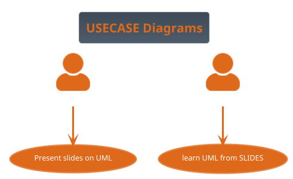
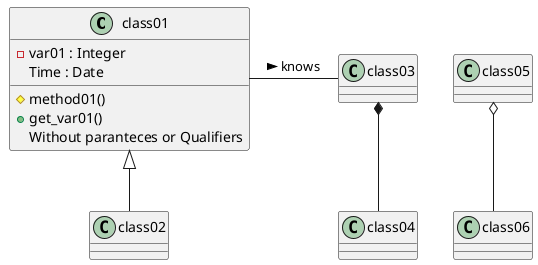

## SDLC
what is *SDLC* or the software development life cycle is a model describing the process of bringing a peice of software to market and maintaining it. The basic steps or as they are know as phases each encompass different tasks  needed to be completed as the software goes from idea to through frution through and iterative process. The early models where depiced as circles stemming from the waterflow modell but emphiszing that the whole process goes through itarations modern views tend to be like the spiral model where each iteration is succeded by a larger spiral, Personally I like to envison the spiral as a coil as it is not nessesary that a followin iteration take more time or is even completed before you start the nest spiral. The coil model emphises the idea that as cost spiral in each iteration eventually the cost of the next phase is higher than the value of continuing att which point the software starts to tricle out of existance.

## Spiral model

## First phase *Risk assesment and planning*

## Second phase  *Design*

## Third phase *Development*
In this course we will not focus on strengthening this phase above the algorithm, testing and optimization that is covered elsewhere in the material.
## Fourth phase *Deplyment*/*Testing*

## Fifth phase *Maintenance*/*Deployment and Maintenance*

# Paradigms of design

## Structural programming, Structured Design

## Object orientation
What is an object? An object is the representation of a thing or concept, that encapsulates both data and the actions perfomed on it.

## Functional programming

## UML
The Unified modeling language was first standardized in november 1997 as [UML-98] it has its origin in Rumbaugh OMT and Jacobsens efforts with the OOSE(object oriented software enginering) it is by that nature very good att describing the Rational unified process, created by Rumbaugh, Booch and Jacobsen in the late 90s. As we 

plantuml.org a way of using UML graphs and charts in markdown, and to specify the relationship between objects using text.

Unified modeling language came from the Rational group and is a modeling language for describing the 
## RUP Rational Unified Process, a method primarily for generating larger objectoriented systems.

## The AGILE manifesto
https://agilemanifesto.org/

## AGILE Development as a respons to what they called document driven development

## SCRUM and how it fits with AGILE development

## Pair Programming 
 A tool for rapid development is the so called Pair Programming where two developers code on the same code simultatiously one as the "Driver" and one as the "Navigator" 