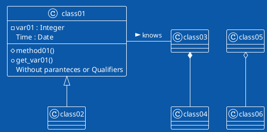

# Software development processes

## SDLC
 *SDLC* ,or the Software Development Life Cycle, is a model describing the process of bringing a peice of software to market and maintaining it. The basic steps or as they are know phases each encompass different tasks  needed to be completed as the software goes from idea to frution through an iterative process. The early models where depicted as circles stemming from the waterflow model. The modern views tend emphisize to focus on the iterative nature of development. <rewrite> One of these the spiral model where each iteration is succeded by a larger spiral. Personally I like to envison the spiral as a helix as it is not nessesary that a followin iteration take more time or is even completed before you start the next one. The helix depiction of the spiral model emphasise the idea that as cost spiral in each iteration eventually the cost of the next phase is higher than the value of continuing at which point the software starts to trickle out of existence.

## Spiral model

## First phase *Risk assessment and Planning*

## Second phase  *Design*

## Third phase *Development*
 Appart the algorithm part, testing, and optimisation that is covered elsewhere in the material we will not focus on development.

## Fourth phase *Deployment*/*Testing*

## Fifth phase *Maintenance*/*Deployment and Maintenance*

# Paradigms of design

## Structural programming, Structured design

## Object Orientation
What is an object? An object is the representation of a thing or concept, that encapsulates both data and the actions perfomed on it.

## Functional programming


# Tools and methodologies  
The tools and methodologies are too numerous to describe in any complete way,<rewrite> and they are always evolving as developers find issues with the models and methodologies they are currently using and trying to adress them there for many models evolve to adress the "lates and greates" method but as on be can guess this means other consessions have to be made. 
<explain system>
The best way to aproach wich methodology one should use is to look at the development requirements of the system that you wish to create and choose the one that lets you do the least amount of work for the highest value. 

In this course we will present a few methodologies which are in no way or form the best or only methods out there but is a start.


## UML
The Unified modelling language was first standardized in November 1997 as [UML-98]. It has its origin in Rumbaugh OMT and Jacobsens efforts with the OOSE (object oriented software enginering). it is by that nature very good att describing the Rational Unified Process (RUP), se below, created by Rumbaugh, Booch and Jacobsen in the late 90s. As we 

plantuml.org a way of using UML graphs and charts in markdown, and to specify the relationship between objects using text.
if the plantuml is not visible




```plantuml
!theme amiga 
(*)--> activity1
if "stuff" then 
-->[true] "action2"
-r->(*)
else 
--> [false](*)
```
Unified modeling language came from the Rational group and is a modeling language for describing the

## RUP Rational Unified Process
A method primarily for generating larger object oriented systems. Partially it can be used even for smaller projects but some of the steps and diagrams would be skipped. The design of the system is a use case driven design where the analyst tries to identify all typical interactions that can be done with the systems. This then works as a requirements analysis for the rest of the design step.


## The AGILE manifesto
https://agilemanifesto.org/

## AGILE Development as a respons to what they called document driven development

## SCRUM and how it fits with AGILE development

## Pair Programming 
 A tool for rapid development is the so called Pair Programming where two developers code on the same code simultatiously one as the "Driver" and one as the "Navigator" 